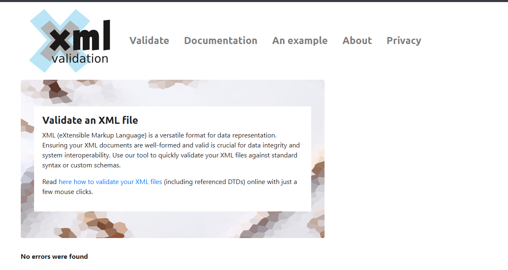
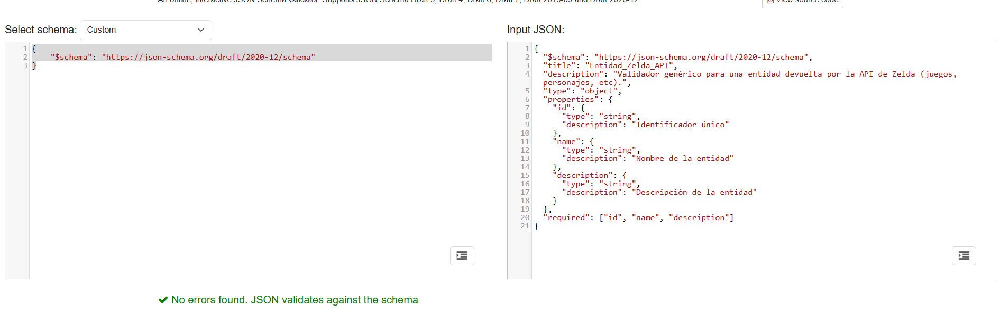

# Proyecto — Enciclopedia Hyrule: API, esquemas y almacenamiento

## Descripción del proyecto
Aplicación web sin servidor, que usa firebase. Está diseñada para buscar datos sobre **The Legend of Zelda**, y permite:
- Buscar información conectándose a una API externa llamada Zelda API.
- Almacenar los resultados de las busquedas en la caché del navegador para mayor velocidad.
- Guardad los datos favoritos en una base de datos de la nube (firestore) para la persistencia de los datos.
- Visualizar el catálogo base de juegos en formato XML y poder exportarlo a CSV desde la interfaz, descargándolo automáticamente al darle al botón.

## Tecnologías y Herramientas
- **HTML5** y **CSS**: Se ha usado un html semántico y del css para darle una mejor visibilidad a la página web.
- **JavaScript**: Se han realizado 5 js para diferentes implementaciones.
- **Firebase**: Para ofrecer persistencia en tiempo real

## La Zelda API

He integrado la Zelda API oficial (`https://zelda.fanapis.com/api`).
El buscador permite consultar hasta **8 endpoints** distintos:

| Endpoint | Qué devuelve |
|---|---|
| `games` | Juegos de la saga con plataforma, año, desarrolladora |
| `characters` | Personajes con descripción y apariciones |
| `monsters` | Enemigos y monstruos con descripción |
| `bosses` | Jefes finales |
| `staff` | Personal de Nintendo que trabajó en los juegos |
| `dungeons` | Mazmorras con descripción |
| `places` | Lugares del universo Zelda |
| `items` | Objetos y equipamiento |

Todos los endpoints devuelven la misma estructura base: `{ success, count, data[] }`. Dentro de `data`, los campos comunes son `id`, `name` y `description`, que son los que el frontend muestra en la tarjeta visual. Campos adicionales como `appearances` varían según el endpoint y se ignoran en la vista de lista, aunque se pueden ver en la página de detalle.

**Ejemplo real de respuesta (JSON)** haciendo GET a `https://zelda.fanapis.com/api/monsters?name=stalizalfos`:
```json
{
  "success": true,
  "count": 1,
  "data": [
    {
      "appearances": [
        "https://zelda.fanapis.com/api/games/5f6ce9d805615a85623ec2c9"
      ],
      "name": "Stalizalfos",
      "description": "Stalizalfos are enemies in Breath of the Wild.",
      "id": "5f6d1715a837149f8b47a19e"
    }
  ]
}
```

**Campos que uso en el frontend:**
- `data[i].id` → identifica el elemento para guardarlo como favorito y para el enlace de detalle.
- `data[i].name` → título principal de la tarjeta.
- `data[i].description` → texto descriptivo (se trunca si es largo).

## Formatos de Datos

El proyecto trabaja con tres formatos distintos, cada uno elegido según el caso de uso:

### JSON
Es el formato estándar de la web moderna para intercambio de datos entre cliente y servidor porque es ligero, fácil de parsear y directamente usable en JS sin conversión.

**En este proyecto:** todo lo que viene de la Zelda API y de Firestore llega en JSON. También es el formato que usa `localStorage` al serializar los datos de caché con `JSON.stringify/parse`.

### XML
Formato basado en etiquetas jerárquicas definidas por el usuario (similar a HTML pero sin propósito visual). Su gran ventaja es que permite adjuntar un esquema (XSD) que valide rigurosamente la estructura del documento. Es más verboso que JSON pero sigue siendo estándar en sistemas heredados, EDI e intercambio entre empresas.

**En este proyecto:** recibimos el catálogo `juegos.xml` del equipo de contenido, que exige reglas gramaticales estrictas. Lo parseamos con `DOMParser` en el navegador y lo convertimos a un array JS para mostrarlo en tabla.

### CSV
Formato de texto plano donde cada línea es un registro y los valores se separan por comas. No tiene jerarquía ni metadatos: es la opción más simple y universal para datos tabulares. Cualquier hoja de cálculo (Excel, Calc, Google Sheets) lo importa sin configuración.

**En este proyecto:** lo generamos como exportación a partir del array JSON de juegos, construyendo las líneas manualmente y descargando el resultado como `Blob`.

### ¿Cuando usaría cada uno?
- **JSON** → comunicación entre servicios web, APIs REST, configuración de apps.
- **XML** → documentos con estructura compleja y validación estricta, sistemas legacy, feeds RSS.
- **CSV** → exportación de datos tabulares simples para consumo humano o en hojas de cálculo.

## Esquemas implementados

### XSD — Validación del XML

Archivo: `schemas/juegos.xsd` (referenciado desde `data/juegos.xml` con `xsi:noNamespaceSchemaLocation`).

Define de forma estricta:
- El elemento raíz `<saga>` debe contener uno o más elementos `<juego>`.
- Cada `<juego>` tiene un atributo `id` obligatorio (tipo `xs:string`).
- Los campos `<titulo>`, `<desarrolladora>`, `<publicadora>` y `<plataforma>` son `xs:string` obligatorios.
- Los campos `<anio>` y `<puntuacion>` son `xs:integer`, lo que impide valores como `"1998a"` o `"noventa y ocho"`.

Si un documento XML no cumple estas reglas, cualquier validador XSD lo rechazará.

**Evidencia de validación:** el archivo fue validado con la extensión *XML Tools* de VS Code y con el [Validador](https://www.xmlvalidation.com/) sin errores.


### JSON Schema — Validación de la estructura de entidades

Archivo: `schemas/entidad_schema.json`.

Define la estructura mínima que debe tener cualquier entidad devuelta por la Zelda API antes de mostrarse en la interfaz:
- `id` (string) — obligatorio.
- `name` (string) — obligatorio.
- `description` (string) — obligatorio.

El campo `required` garantiza que si la API devolviera un objeto incompleto, el frontend podría detectarlo antes de intentar renderizarlo y evitar tarjetas rotas o con valores `undefined`.

**Evidencia de validación:** schema comprobado con [jsonschemavalidator.net](https://www.jsonschemavalidator.net/) sin errores de estructura.


## Almacenamiento

El proyecto distingue dos tipos de datos con necesidades opuestas:

### localStorage — Caché de búsquedas

**Por qué aquí:** la lectura de `localStorage` es síncrona e instantánea (no genera peticiones HTTP), lo que permite mostrar resultados previos al instante sin esperar a la red. Es el mecanismo ideal para una caché temporal en el lado del cliente.

**Limitaciones que lo hacen inadecuado para los favoritos:**
- **Sin persistencia entre dispositivos:** los datos viven solo en el navegador donde se guardaron. Si el usuario cambia de PC o borra el historial del navegador, lo pierde todo.
- **Sin control de acceso:** cualquier script de la misma origin puede leer o modificar los datos.
- **Capacidad limitada:** típicamente 5–10 MB por origen, lo que lo hace inviable para grandes volúmenes de datos.
- **Sin sincronización:** no hay forma de que dos dispositivos compartan los mismos datos en tiempo real.

### Firebase Firestore — Favoritos persistentes

**Por qué aquí:** Firestore es una base de datos NoSQL distribuida en la nube. Los favoritos necesitan sobrevivir entre sesiones y dispositivos, y Firestore lo garantiza porque los datos residen en servidores de Google, no en el navegador.

**Aislamiento de usuarios sin autenticación formal:**

Para que cada usuario solo vea y gestione sus propios favoritos sin necesidad de login, se implementó un sistema de **ID anónimo persistente**: la primera vez que alguien entra a la web, se genera un UUID único con `crypto.randomUUID()` y se guarda en su `localStorage`. Ese UUID sirve como identificador de sesión.

Los favoritos se guardan bajo la ruta `usuarios/{userId}/favoritos` en Firestore, de forma que cada usuario opera sobre su propia subcolección y no puede ver ni borrar los del resto

**Reglas de seguridad de Firestore:**

Las reglas actuales restringen el acceso únicamente a la subcolección de cada usuario, usando el `{userId}` como segmento de ruta:
```
rules_version = '2';
service cloud.firestore {
  match /databases/{database}/documents {
    match /usuarios/{userId}/{document=**} {
      allow read, write, delete: if true;
    }
  }
}
```
Con esto, solo se puede leer y escribir dentro de `usuarios/{userId}/...`. Un usuario no puede acceder a la colección raíz ni a documentos fuera de su subárbol. El aislamiento entre usuarios lo garantiza la lógica del cliente (cada navegador tiene su UUID único), aunque en producción esto seguiría siendo insuficiente: si alguien conoce el UUID de otro usuario podría operar sobre sus documentos.

## Decisiones Técnicas

### 1. Debounce en el buscador (150 ms)
En lugar de lanzar una petición a la API con cada tecla pulsada, se implementó un `debounce` de 150 ms: el temporizador se reinicia con cada pulsación y solo dispara la búsqueda cuando el usuario deja de escribir. Sin esto, escribir "Ganon" generaría 5 peticiones innecesarias (G, Ga, Gan, Gano, Ganon), saturando la API y el `localStorage`. La elección de 150 ms (frente a los típicos 300–500 ms) da una respuesta percibida como instantánea sin sacrificar rendimiento.

### 2. Promise.all para búsquedas globales ("Todo el universo")
Cuando el usuario selecciona la opción "All", se necesita consultar los 8 endpoints en paralelo. Se usó `Promise.all` con `.catch(() => [])` por endpoint en lugar de 8 `await` secuenciales: el tiempo total es el del endpoint más lento en lugar de la suma de los 8. El `catch` individual asegura que si un endpoint falla, el resto de resultados se muestran igualmente.

### 3. Separación de módulos por responsabilidad
El código se dividió en `api.js` (lógica de red y caché), `transform.js` (parseo XML y exportación CSV), `firebase.js` (configuración y operaciones Firestore) y `ui.js` (manipulación del DOM y eventos). Esta separación permite modificar la fuente de datos (por ejemplo, cambiar la API) sin tocar la capa de presentación, y facilita la detección de errores porque cada fichero tiene una única responsabilidad.

## Instrucciones de Uso y Puesta en marcha

### Opcion 1
Utiliza el siguiente enlace que te lleva a las pages de GitHub:
- https://antoniojmora.github.io/API-Antonio/

### Opcion 2

1. **Clona o descarga** el repositorio en tu equipo local.

2. **Usa un servidor local** — la aplicación usa `fetch` para cargar el XML y comunicarse con Firebase, lo que requiere protocolo HTTP. Abriendo el `index.html` directamente (doble clic → `file://`) el navegador bloqueará las peticiones por política CORS.
   - **VS Code:** instala la extensión *Live Server* y haz clic derecho en `index.html` → "Open with Live Server".
   - **Terminal (Python):** `python -m http.server 8000` desde la carpeta del proyecto.
   - **Terminal (Node):** `npx serve .`

3. Accede a la URL resultante (por ejemplo `http://localhost:8000`).

4. **Configura Firebase** para que funcionen los favoritos:
   - Ve a [console.firebase.google.com](https://console.firebase.google.com/) y crea un proyecto gratuito.
   - Activa **Firestore Database** en modo prueba.
   - En *Configuración del proyecto → Tus apps*, crea una app web y copia el objeto `firebaseConfig`.
   - Pega el objeto en `js/firebase.js` (línea 10), sustituyendo los valores de ejemplo.

5. ¡Listo! El buscador funciona sin Firebase; los favoritos requieren la configuración anterior.